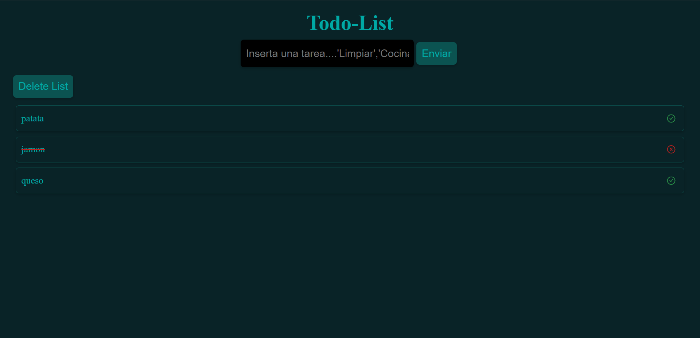

        

## 🖥️ Despliegue

Seguro que tienes que ir hacer la compra y no tienes un boligrafo y papel [no te preocupes da click aqui y podras tener tu lista](https://todo-list-reactts.netlify.app/)

## 🚀 Instalación

1. Clona este proyecto.
2. Ve a la carpeta del proyecto
   `todo-list`
3. Instala las dependencias
   `npm install`
4. Corre en local
   `npm run start`
